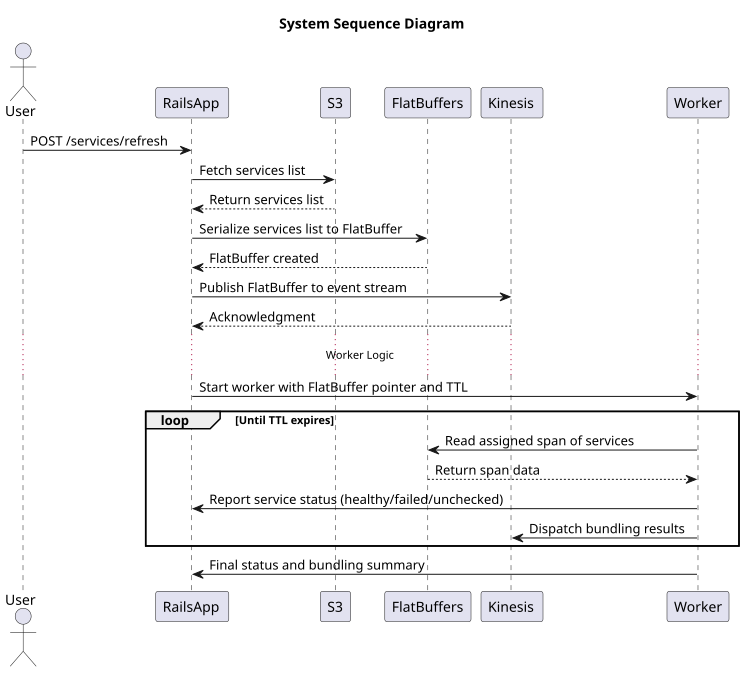

# Healthcheck

Task

Create an app which does health checks in intervals (e.g. every minute). The status of a service is determined by the HTTP response code. A HTTP status code of 200 means the service is healthy and a HTTP status code of 500 means the status is unhealthy. For this exercise a service will be unhealthy 10% of the time (random). Each service is identified by a UUID. For simplicity the health check endpoint will return it's own UUID (see curl example).
You can use any programming language you like and are free to use any resource available to you.

tl;dr;

- Observe 1M services each minute
- 10% of the requests will fail

URL https://go-serv-interview-4a0642b972b8.herokuapp.com/$uuid

Example

$ curl https://go-serv-interview-4a0642b972b8.herokuapp.com/4BD01067-A441-47ED-9487-AAACA73CB7F4
{"ID":"4BD01067-A441-47ED-9487-AAACA73CB7F4"}

## System Design

## Getting Started

This project uses `.ruby-version` to autoswitch rubies. To install a ruby with chruby:

> chruby ruby-3.4.1

